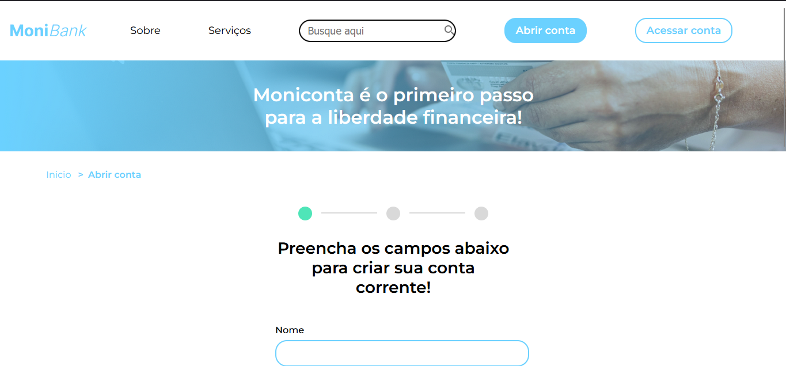
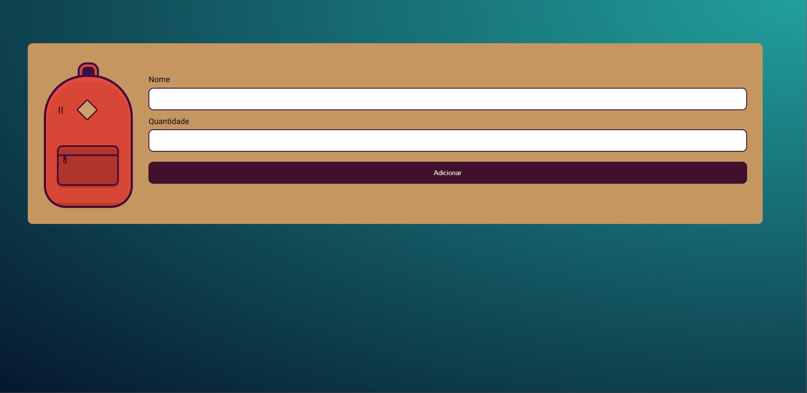
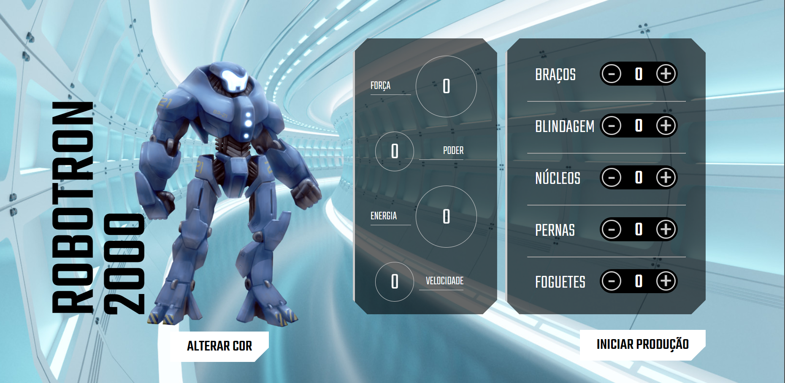
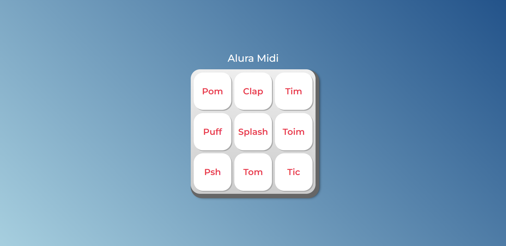

  <h1>Olá! 👋🤓</h1>
  
Aqui é onde eu registro tudo o que estudo e pratico.

  
Então vamos lá! Rumo à excelência! 🚀

  <h2>Meus estudos 👨‍💻</h2>
  <table>
    <thead>
      <tr>
        <th>Nome do Projeto</th>
        <th>Tecnologias</th>
        <th>Referência</th>
        <th>Código do Projeto</th>
        <th>Página do Projeto</th>
      </tr>
    </thead>
    <tbody>
    <tr>
        <td><strong>Mobi Bank</strong></td>
        <td>HTML5, CSS3 e JavaScript</td>
        <td>Alura</td>
        <td><a href="https://github.com/RafaelNikolasPuggi/My_Learning/tree/main/Alura/JavaScript%20-%20Validando%20formul%C3%A1rios">Código</a></td>
        <td></td>
    </tr>
    <tr>
        <td><strong>Alura Play</strong></td>
        <td>HTML5, CSS3, JavaScript, NodeJS e Json-server</td>
        <td>Alura</td>
        <td><a href="https://github.com/RafaelNikolasPuggi/My_Learning/tree/main/Alura/JavaScript%20-%20Criando%20requisições">Código</a></td>
        <td></td>
    </tr>
    <tr>
        <td><strong>Consulta Via CEP</strong></td>
        <td>HTML5, CSS3 e JavaScript</td>
        <td>Alura</td>
        <td><a href="https://github.com/RafaelNikolasPuggi/My_Learning/tree/main/Alura/JavaScript%20-%20Consumindo%20dados%20API%20main">Código</a></td>
        <td></td>
    </tr>
    <tr>
        <td><strong>Mochila de Viagem</strong></td>
        <td>HTML5, CSS3 e JavaScript</td>
        <td>Alura</td>
        <td><a href="https://github.com/RafaelNikolasPuggi/My_Learning/tree/main/Alura/JavaScript%20na%20Web%20-%20Armazenando%20dados%20no%20navegador/Mochila">Código</a></td>
        <td></td>
      </tr>
      <tr>
        <td><strong>Robotron 2000</strong></td>
        <td>HTML5, CSS3 e JavaScript</td>
        <td>Alura</td>
        <td><a href="https://github.com/RafaelNikolasPuggi/My_Learning/tree/main/Alura/JavaScript%20-%20Manipulando%20o%20DOM/Robotron-2000">Código</a></td>
        <td></td>
      </tr>
      <tr>
        <td><strong>Alura Midi</strong></td>
        <td>HTML5, CSS3 e JavaScript</td>
        <td>Alura</td>
        <td><a href="https://github.com/RafaelNikolasPuggi/My_Learning/tree/main/Alura/JavaScript%20para%20Web%20-%20Crie%20p%C3%A1ginas%20din%C3%A2micas/Aluramidi">Código</a></td>
        <td></td>
      </tr>
      <tr>
        <td><strong>Alura Fone</strong></td>
        <td>HTML5, CSS3 e JavaScript</td>
        <td>Alura</td>
        <td><a href="https://github.com/RafaelNikolasPuggi/My_Learning/tree/main/Alura/JavaScript%20para%20Web%20-%20Crie%20p%C3%A1ginas%20din%C3%A2micas/Alura%20Fone">Código</a></td>
        <td></td>
      </tr>
      <tr>
        <td><strong>Formulário de login Dark e Light</strong></td>
        <td>HTML5, CSS3 e JavaScript</td>
        <td>YouTuber Larissa Kich</td>
        <td><a href="https://github.com/RafaelNikolasPuggi/My_Learning/tree/main/Youtube/Larissakich/Formulario%20Responsivo">Código</a></td>
        <td></td>
      </tr>
      <tr>
        <td><strong>Formulário Responsivo</strong></td>
        <td>HTML5 e CSS3</td>
        <td>YouTuber Larissa Kich</td>
        <td><a href="https://github.com/RafaelNikolasPuggi/My_Learning/tree/main/Youtube/Larissakich/Formulario%20Responsivo">Código</a></td>
        <td></td>
      </tr>
      <tr>
        <td><strong>Relogio Digital</strong></td>
        <td>HTML5, CSS3 e JavaScript</td>
        <td>YouTuber Larissa Kich</td>
        <td><a href="https://github.com/RafaelNikolasPuggi/My_Learning/tree/main/Youtube/Larissakich/Rel%C3%B3gio%20Digital">Código</a></td>
        <td></td>
      </tr>
      <tr>
        <td><strong>Botão Mais ou Menos</strong></td>
        <td>HTML5, CSS3 e JavaScript</td>
        <td>YouTuber Larissa Kich</td>
        <td><a href="https://github.com/RafaelNikolasPuggi/My_Learning/tree/main/Youtube/Larissakich/Bot%C3%A3o%20mais%20ou%20menos">Código</a></td>
        <td></td>
      </tr>
      <tr>
        <td><strong>Smartphone Social</strong></td>
        <td>HTML5 e CSS3</td>
        <td>Curso em Vídeo e Estudonauta</td>
        <td><a href="https://github.com/RafaelNikolasPuggi/My_Learning/tree/main/Estudonauta%20-%20Curso%20em%20V%C3%ADdeo/HTML5%20e%20CSS3/Desafios/Des_15_Projeto_Social">Código</a></td>
        <td></td>
      </tr>
      <tr>
        <td><strong>Cordel Moderno</strong></td>
        <td>HTML5 e CSS3</td>
        <td>Curso em Vídeo e Estudonauta</td>
        <td><a href="https://github.com/RafaelNikolasPuggi/My_Learning/tree/main/Estudonauta%20-%20Curso%20em%20V%C3%ADdeo/HTML5%20e%20CSS3/Desafios/Des_12_Projeto_cordel">Código</a></td>
        <td></td>
      </tr>
      <tr>
        <td><strong>Web Droid</strong></td>
        <td>HTML5 e CSS3</td>
        <td>Curso em Vídeo e Estudonauta</td>
        <td><a href="https://github.com/RafaelNikolasPuggi/My_Learning/tree/main/Estudonauta%20-%20Curso%20em%20V%C3%ADdeo/HTML5%20e%20CSS3/Desafios/Des_10_Projeto_web_droid">Código</a></td>
        <td></td>
      </tr>
      <tr>
        <td><strong>Verificador de idade</strong></td>
        <td>HTML5, CSS3 e JavaScript</td>
        <td>Curso em Vídeo e Estudonauta</td>
        <td><a href="https://github.com/RafaelNikolasPuggi/My_Learning/tree/main/Estudonauta%20-%20Curso%20em%20V%C3%ADdeo/Estudos%20JS/ex015">Código</a></td>
        <td></td>
      </tr>
